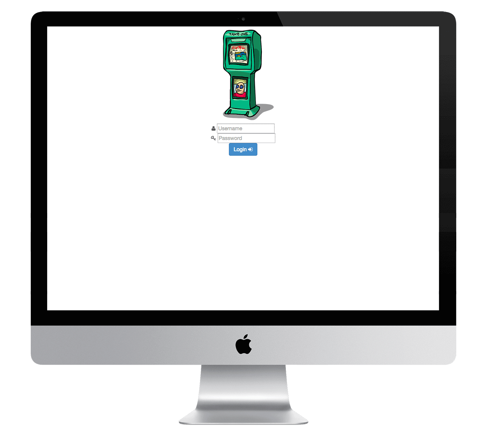
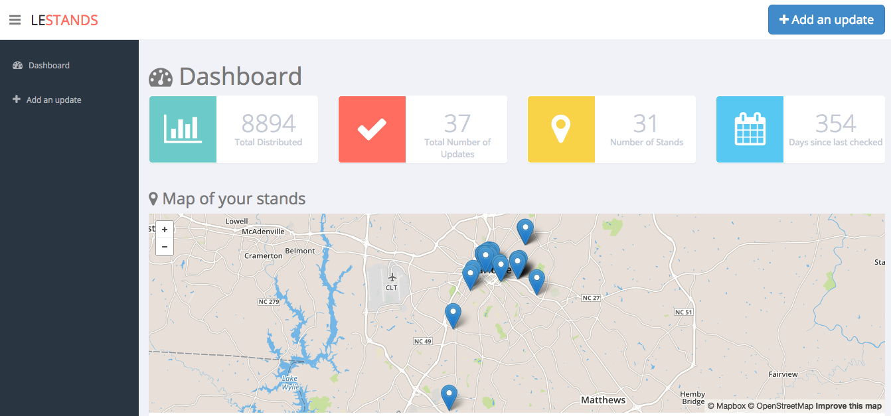
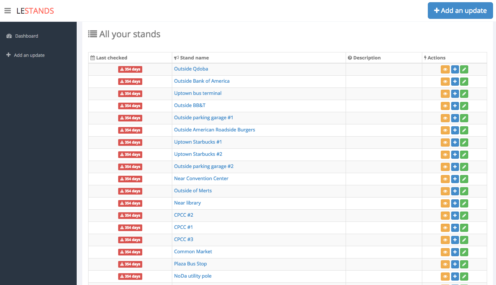
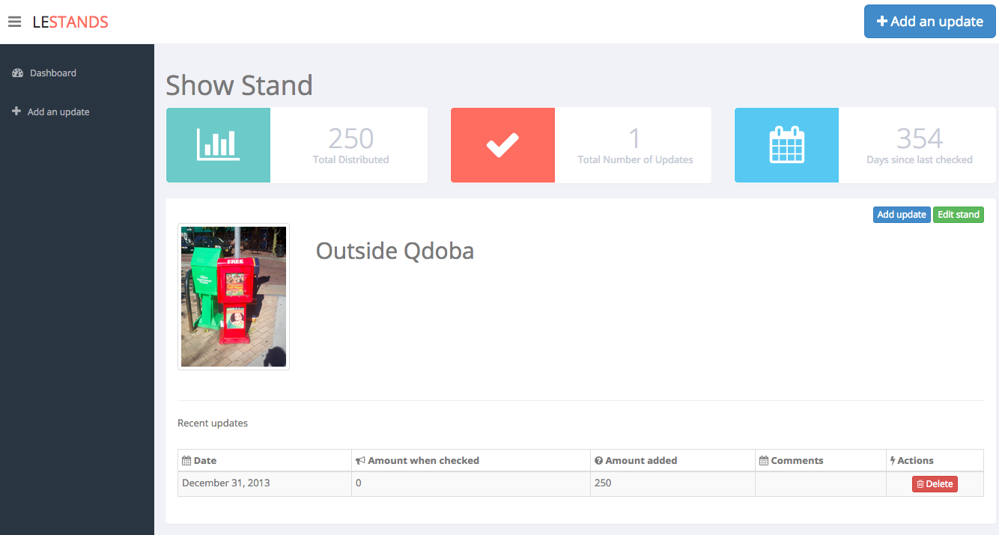
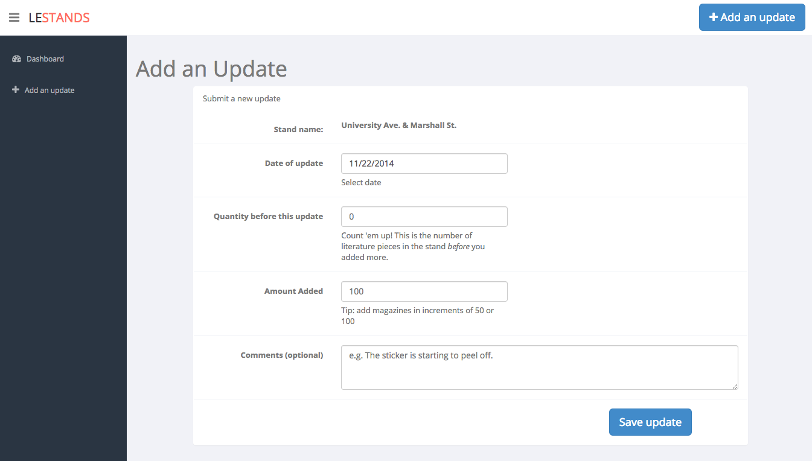

leStandsJS?
==========

[leStands](http://lestands.com) is a web application that helps volunteers country track the performance of free literature stands.

leStandsJS is a new javascript version of lestands. It's primarily a frontend application with a lightweight API backend.

## Tools used
* Frontend: The frontend uses BackboneJS, UnderscoreJS, jQuery, Bootstrap, FontAwesome, HandlebarsJS, and LeafletJS.
* Backend: NodeJS with restify for routes and postgres for the database.
* Deployed on heroku

# Screenshots
## Quick walkthrough

## Dashboard pic 1

## Dashboard pic 2

## Individual stand pic

## Add an update pic

# How do I run the application locally?
## Frontend

Switch to the `master` branch and run this in your code directory

` python -m SimpleHTTPServer 8000 `

Then point your brower to: http://localhost:8000/

## Backend
* The sql schema and some example data are located in the `files` branch
* Switch to the files branch.
* Load the schema into your database and load in some example data:
  * `heroku pg:psql < leStands-schema.sql `
  * `heroku pg:psql < leStands-data.sql`

Switch to the `backend` branch.
 * Run `npm install`
 * Run `npm start`

Note: since they're on different branches you can't really run both at the same time. The way I do it is I deploy the backend to heroku and run the frontend locally.

And if you want your local frontend to consume your the backend that you deployed, you need to update the references to the api in the frontend code. But don't commit those changes to the github repo, ok? :)

# How can I help?
## Report a bug or suggest a feature
This project is using the issue tracker on this github repo as the main source for issues, bugs, and features. If you have a feature idea or if you have noticed a bug, please don't hesitate to file an issue.
